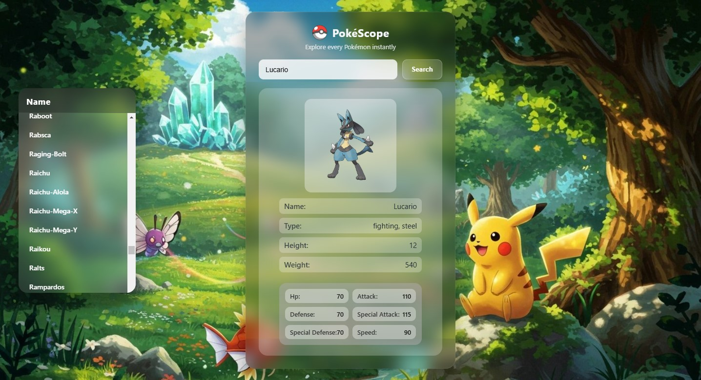

# 🔎 PokéScope

> _"Explore every Pokémon instantly."_  


(https://mrbengalihacker.github.io/Poke-Scope/)

🎯 **Live Demo:**  
👉 https://mrbengalihacker.github.io/Poke-Scope/

---

## ✨ Features

- 🔎 Search Pokémon by name
- 📜 Sidebar with full Pokémon list
- 🖱 Click any Pokémon from the sidebar to view details instantly 
- 🖼 Display official Pokémon artwork fetched from PokéAPI
- 📊 Detailed stats (HP, Attack, Defense, Speed, etc.) 
- ⚡ Instant dynamic UI updates
- ⏳ Loading & error states
- 🧩 Modular JavaScript architecture (API / UI / Utils separation)
- 🎨 Modern glassmorphism UI design
- 📱 Basic responsive layout (desktop + tablet desktop layout + mobile stacked)

---

## 🖼️ Preview



---

## 🛠 Tech Stack

- 🔹 HTML5  
- 🔹 CSS3 (Layout, Components, Responsive)
- 🔹 JavaScript (ES Modules / Vanilla JS)
- 🔹 PokéAPI — real-time Pokémon data source  

---

## 🧠 Learning Focus

This project was built to:

- Work with real public APIs
- Practice async/await data fetching
- Implement modular frontend architecture
- Separate API logic from UI rendering
- Handle loading and error states properly
- Build a product-style interface instead of a static demo
- Practice responsive layout design
---

## 📦 Installation

```bash
git clone https://github.com/MrBengaliHacker/Poke-Scope.git
cd Poke-Scope
# Open index.html in your browser
```

---

## 📁 Folder Structure

```
📦 Poke-Scope
 │
 ├─ index.html
 │
 ├─ assets/
 │   ├─ Poke_Ball.webp
 │   ├─ pokeBg.jpg
 │   └─ preview.jpg
 │
 ├─ css/
 │   ├─ reset.css
 │   ├─ layout.css
 │   ├─ components.css
 │   └─ pages.css
 │
 ├─ js/
 │   ├─ main.js
 │   ├─ api.js
 │   ├─ ui.js
 │   └─ utils.js
 │ 
 ├─ README.md
```
---

## 🚀 Future Improvements

- ⭐ Favorites / bookmark system to save Pokémon  
- 🔎 Search history and recently viewed Pokémon  
- 🧭 Multi-page experience (dedicated Pokémon details page)  
- 🃏 Pokémon card collection / gallery view  
- 📱 Advanced responsive refinements and mobile UX improvements  

---

## 🧑‍💻 Author

**Ritam Mondal (MrBengaliHacker)**  
A passionate Computer Science student & Frontend Developer.

🔗 GitHub Profile — https://github.com/MrBengaliHacker  

---

⭐ If you found this project useful, consider giving it a star!
